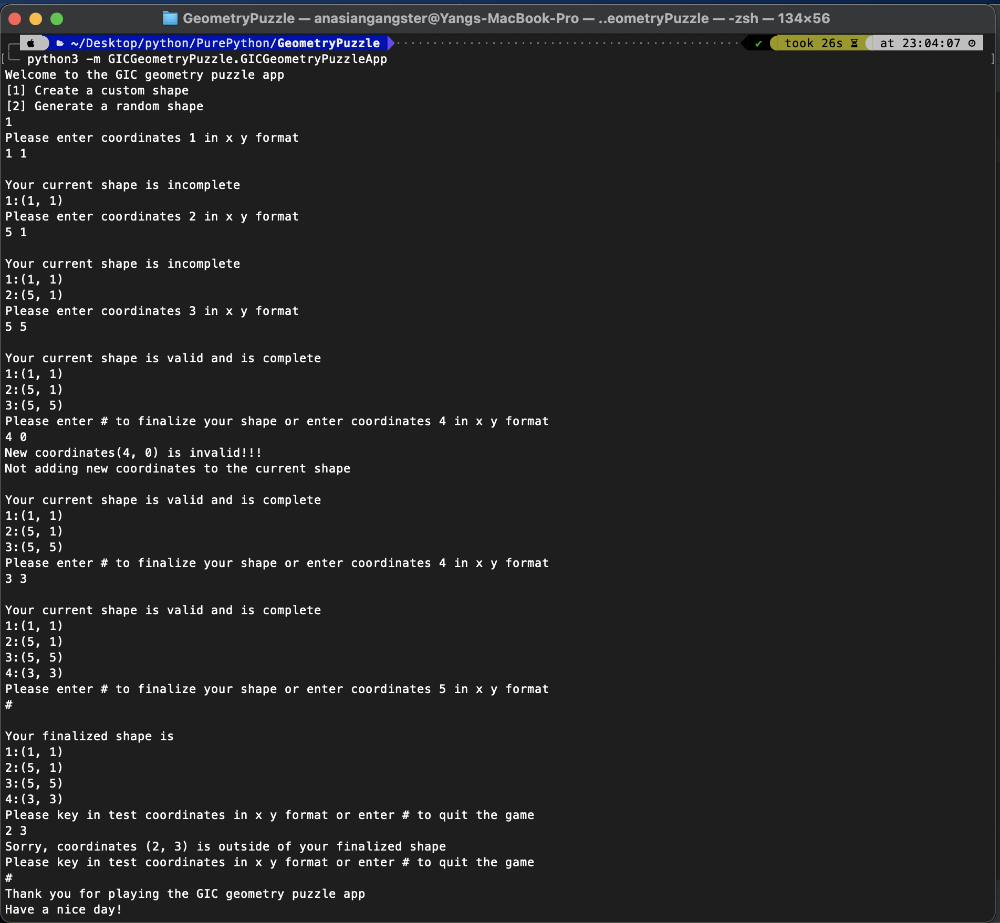
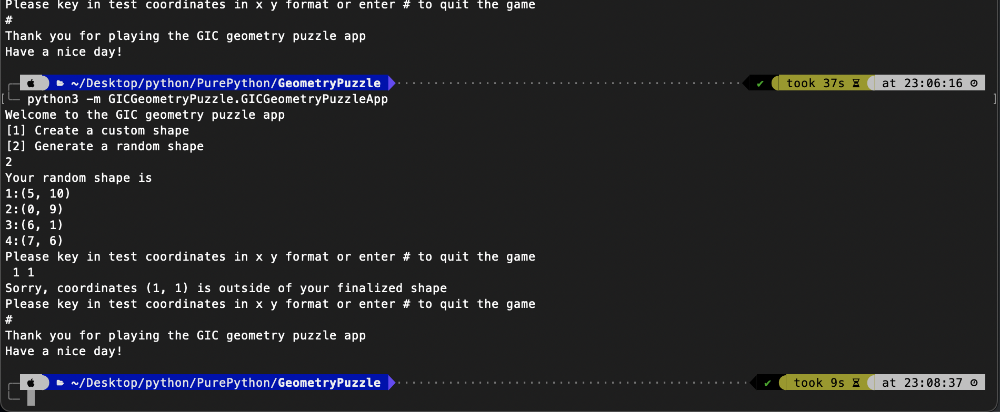

# Explanation

---

## File Structure

```shell
.
├── GICGeometryPuzzle
│   ├── GICGeometryPuzzleApp.py # application code
├── GICGeometryPuzzleTest
│   ├── GICGeometryPuzzleTest.py # testcase code
├── start.sh # sample command to run the application
└── test.sh # sample test command
```

## Code Structure

```python
class ShapeChecker # utility shape checker static functions
class GeometryShape # shape class itself
class ApplicationConstants # contants like mode, string literals
class ApplicationContext # context when the application runs
class ApplicationRunner # execute the application
```

>The application runs exactly as the instruction gives. I used python as it is easier to run and simple

## Actual Code

Can use the online python interpreter to run the actual code from `GICGeometryPuzzleApp.py`, but the since the runtime is not exactly the same there are little minimal difference such as the line breaks `\n` are rendered differently.

https://www.programiz.com/python-programming/online-compiler/

```python
import copy
import random


class ShapeChecker:
    @staticmethod
    def _shoelace(coordsList):
        """shoelace method,
        :return float, the area the polygon"""
        n = len(coordsList)
        area = 0.0
        for i in range(n):
            j = (i + 1) % n
            area += coordsList[i][0] * coordsList[j][1] - coordsList[j][0] * coordsList[i][1]
        return abs(area / 2.0)

    @staticmethod
    def is_valid_shape(coordsList):
        """:return bool, if coordinates form a shape"""
        return ShapeChecker._shoelace(coordsList) > 0


class GeometryShape:
    def __init__(self, coordList):
        self.coordList = coordList

    def __repr__(self):
        reprList = []
        for i in range(len(self.coordList)):
            reprList.append(f"{i + 1}:{self.coordList[i]}")
        return "\n".join(reprList)

    def is_complete(self):
        """:return bool, if shape is complete"""
        return len(self.coordList) >= 3 and ShapeChecker.is_valid_shape(self.coordList)

    def add_coordinate(self, coordinate):
        """:return bool, if adding coordinate is successful"""
        if coordinate in self.coordList:
            return False

        coordsListToBeChecked = copy.copy(self.coordList)
        coordsListToBeChecked.append(coordinate)
        if (not ShapeChecker.is_valid_shape(coordsListToBeChecked)) and len(self.coordList) >= 3:
            return False
        else:
            self.coordList.append(coordinate)
            return True

    def is_point_inside(self, point):
        """ray casting algorithm"""
        numVertices = len(self.coordList)
        j = numVertices - 1
        isInside = False
        for i in range(numVertices):
            if ((self.coordList[i][1] > point[1]) != (self.coordList[j][1] > point[1])) and \
                    (point[0] < (self.coordList[j][0] - self.coordList[i][0]) * (point[1] - self.coordList[i][1]) /
                     (self.coordList[j][1] - self.coordList[i][1]) + self.coordList[i][0]):
                isInside = not isInside
            j = i
        return isInside

    @staticmethod
    def generate_random_polygon():
        coordinates = []
        numOfCoords = random.randint(3, 8)
        for i in range(numOfCoords):
            x = random.randint(0, 10)
            y = random.randint(0, 10)
            coordinates.append((x, y))
        return GeometryShape(coordinates)


class ApplicationConstants:
    # presentation constants
    WELCOME_STR = "Welcome to the GIC geometry puzzle app\n[1] Create a custom shape\n[2] Generate a random shape"
    GOODBYE_STR = "Thank you for playing the GIC geometry puzzle app\nHave a nice day!"
    # test coordinate constant
    TEST_COORD_PROMPT = "\nPlease key in test coordinates in x y format or enter # to quit the game\n"
    # application mode constants
    USER_CREATE_MODE = "1"
    APPL_GEN_MODE = "2"


class ApplicationContext:
    def __init__(self, applicationConstants):
        self.constants = applicationConstants


class ApplicationRunner:
    def __init__(self, applicationContext):
        self.context = applicationContext

    def _test_coordinate_in_shape(self, shape):
        userInput = input(self.context.constants.TEST_COORD_PROMPT).strip()
        while userInput != "#":
            coordinatesStr = userInput
            curCoordinate = tuple(map(int, coordinatesStr.strip().split()))
            if shape.is_point_inside(curCoordinate):
                print(f"Coordinates {curCoordinate} is within your finalized shape")
            else:
                print(f"Sorry, coordinates {curCoordinate} is outside of your finalized shape")
            userInput = input(self.context.constants.TEST_COORD_PROMPT).strip()

    def _user_create_shape(self):
        userShape = GeometryShape([])
        while not userShape.is_complete():
            # user input coordinates < 3
            coordinatesStr = input(f"Please enter coordinates {len(userShape.coordList) + 1} in x y format\n").strip()
            curCoordinate = tuple(map(int, coordinatesStr.strip().split()))
            add_result = userShape.add_coordinate(curCoordinate)
            if not add_result:
                print(
                    f"New coordinates{curCoordinate} is invalid!!!\nNot adding new coordinates to the current shape")
            if userShape.is_complete():
                break
            print("\nYour current shape is incomplete\n" + str(userShape))

        print("\nYour current shape is valid and is complete\n" + str(userShape))
        userInput = input(
            f"Please enter # to finalize your shape or enter coordinates "
            f"{len(userShape.coordList) + 1} in x y format\n").strip()

        while userInput != "#":
            # user chose continuing inputting coordinates
            coordinatesStr = userInput
            curCoordinate = tuple(map(int, coordinatesStr.strip().split()))
            add_result = userShape.add_coordinate(curCoordinate)
            if not add_result:
                print(f"New coordinates{curCoordinate} is invalid!!!\nNot adding new coordinates to the current shape")

            print("\nYour current shape is valid and is complete\n" + str(userShape))
            userInput = input(f"Please enter # to finalize your shape or enter coordinates "
                              f"{len(userShape.coordList) + 1} in x y format\n").strip()
        # final shape
        print("\nYour finalized shape is\n" + str(userShape))
        self._test_coordinate_in_shape(userShape)

    def _generate_shape(self):
        randomShape = GeometryShape.generate_random_polygon()
        print("Your random shape is\n" + str(randomShape))
        self._test_coordinate_in_shape(randomShape)

    def run(self):
        print(self.context.constants.WELCOME_STR)
        applicationMode = input().strip()
        if applicationMode == self.context.constants.USER_CREATE_MODE:
            self._user_create_shape()
        elif applicationMode == self.context.constants.APPL_GEN_MODE:
            self._generate_shape()
        print(self.context.constants.GOODBYE_STR)


if __name__ == '__main__':
    # init application
    applicationContext = ApplicationContext(ApplicationConstants)
    applicationRunner = ApplicationRunner(applicationContext)
    # running application
    applicationRunner.run()

```

## Some Screenshots




